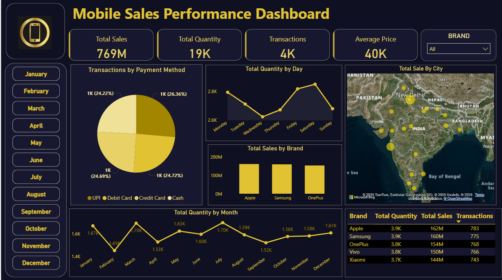

# 📱 Mobile Sales Performance Dashboard


---

## 📌 Project Overview

The **Mobile Sales Performance Dashboard** is an interactive business intelligence solution built using **Microsoft Power BI**. It provides a comprehensive 360° view of mobile phone sales performance across brands, cities, payment methods, and time periods. Designed for sales managers, business analysts, and stakeholders, this dashboard enables data-driven decision-making by surfacing key trends, revenue patterns, and customer behavior insights.

> 💡 This project is part of a data analytics portfolio demonstrating proficiency in Power BI, data modeling, DAX, and visual storytelling.

---

## 🖼️ Dashboard Preview



> *Replace the above path with your actual dashboard screenshot.*

---

## ✨ Key Features

- 📊 **KPI Cards** — At-a-glance metrics for Total Sales, Total Quantity, Transactions, and Average Price
- 📅 **Monthly Filter** — Slicer panel to filter all visuals by any month (January–December)
- 🏷️ **Brand Filter** — Dropdown slicer to isolate performance by brand (Apple, Samsung, OnePlus, Vivo, Xiaomi)
- 🥧 **Payment Method Breakdown** — Pie chart showing transaction share by UPI, Debit Card, Credit Card, and Cash
- 📈 **Daily Sales Trend** — Line chart tracking total quantity sold across each day of the week
- 🗺️ **Geographic Sales Map** — India map visual showing total sales concentration by city
- 📉 **Monthly Quantity Trend** — Line chart displaying seasonal quantity fluctuations month over month
- 📊 **Brand-wise Revenue Bar Chart** — Comparative bar chart of total sales across top mobile brands
- 📋 **Brand Summary Table** — Tabular view of Total Quantity, Total Sales, and Transactions per brand

---

## 🛠️ Tools & Technologies

| Tool | Purpose |
|------|---------|
| **Microsoft Power BI Desktop** | Dashboard design, data modeling & visualization |
| **Microsoft Excel** | Raw data storage and initial formatting |
| **Power Query (M Language)** | Data cleaning, transformation, and shaping |
| **DAX (Data Analysis Expressions)** | Calculated measures, KPIs, and custom aggregations |
| **Bing Maps (Power BI built-in)** | Geographic visualization of city-level sales |

---

## 📂 Dataset Description

The dataset simulates a real-world mobile retail sales scenario with the following columns:

| Column | Description |
|--------|-------------|
| `Transaction ID` | Unique identifier for each sale |
| `Day` | Day number of the month |
| `Month` | Month number (1–12) |
| `Year` | Year of transaction |
| `Day Name` | Weekday name (Monday–Sunday) |
| `Brand` | Mobile brand (Apple, Samsung, OnePlus, Vivo, Xiaomi) |
| `Units Sold` | Number of units sold per transaction |
| `Price Per Unit` | Selling price of one unit (INR) |
| `Customer Name` | Name of the customer |
| `Customer Age` | Age of the customer |
| `City` | City where the transaction occurred |
| `Payment Method` | Mode of payment (UPI, Debit Card, Credit Card, Cash) |
| `Customer Rating` | Customer satisfaction score (1–5) |
| `Mobile Model` | Specific model name (e.g., iPhone 12, Galaxy Note 20) |

> **Dataset Size:** ~4,000 transactions | **Time Period:** Full calendar year (2021) | **Geography:** India

---

## 📊 Insights & Analysis

### 💰 Revenue Performance
- Total revenue reached **₹769 Million** across **4,000+ transactions**, with an average transaction value of **₹40,000**, indicating a strong mid-to-premium segment focus.

### 🏆 Brand Rankings
- **Apple** leads revenue at **₹162M** with 3.9K units sold and 783 transactions, closely followed by **Samsung (₹160M)** and **OnePlus (₹154M)**.
- Despite similar unit volumes (~3.7K–3.9K), Apple commands higher revenue — confirming its premium pricing advantage.

### 📅 Seasonal Trends
- **March and July** were the strongest months by quantity (~1.70K), while **February** recorded the lowest (~1.45K), likely impacted by fewer selling days.
- Sales remain relatively stable throughout the year with a mild uptick in **December (1.61K)**, suggesting year-end demand or festive buying.

### 📆 Weekly Patterns
- **Saturday** records the highest daily quantity (~2.8K), confirming that weekend shopping drives significant footfall.
- **Wednesday** sees the weakest sales volume, presenting an opportunity for mid-week promotions.

### 💳 Payment Preferences
- Payment methods are nearly evenly distributed: **UPI (26.36%)**, **Cash (24.72%)**, **Credit Card (24.69%)**, and **Debit Card (24.22%)**.
- The near-equal split suggests no single payment channel dominates, and customers value flexibility.

### 🗺️ Geographic Insights
- Sales are concentrated in **Tier-1 cities**: Delhi, Mumbai, Bangalore, Hyderabad, and Chennai show the largest bubbles on the map.
- Emerging markets in **Tier-2 cities** (Coimbatore, Vadodara, Ludhiana) indicate growing middle-class demand outside metros.

---

## ⚙️ Installation & Setup

### Prerequisites
- [Power BI Desktop](https://powerbi.microsoft.com/desktop/) (Free download)
- Microsoft Excel (for data source access)

### Steps

1. **Clone this repository**
   ```bash
   git clone https://github.com/yourusername/mobile-sales-dashboard.git
   cd mobile-sales-dashboard
   ```

2. **Open the dataset**
   - Navigate to the `/data` folder
   - Open `mobile_sales_data.xlsx` to review raw data

3. **Open the Power BI report**
   - Launch **Power BI Desktop**
   - Open `Mobile_Sales_Dashboard.pbix`

4. **Refresh the data source** *(if prompted)*
   - Go to **Home → Transform Data → Data Source Settings**
   - Update the file path to match your local directory
   - Click **Close & Apply**

5. **Explore the Dashboard**
   - Use month slicers, brand filters, and interactive visuals to explore insights

---

## 🧭 How to Use the Dashboard

| Action | How To |
|--------|--------|
| Filter by Month | Click any month button on the left panel |
| Filter by Brand | Use the **Brand** dropdown at the top right |
| View City Sales | Hover over map bubbles to see city-level data |
| Reset All Filters | Click **Ctrl + Z** or use the Reset button (if configured) |
| Drill Through | Right-click on a brand bar to explore transaction-level details |
| Export Data | Right-click any visual → **Export Data** |

---

## 🗂️ File Structure

```
mobile-sales-dashboard/
│
├── mobile_sales_data.xlsx          # Raw sales dataset
│  
│
├── overview.png          # Full dashboard screenshot
│   
│  
│
├── Mobile_Sales_Dashboard.pbix     # Power BI report file
│   
│
└── 📄 README.md                        # Project documentation

```

---

## 🚀 Future Improvements

- [ ] 🔄 **Live Data Integration** — Connect to a SQL Server or Azure database for real-time refresh
- [ ] 🌐 **Power BI Service Publishing** — Publish to Power BI Service for web access and scheduled refresh
- [ ] 📱 **Mobile Layout Optimization** — Build a dedicated phone-optimized view using Power BI's mobile layout editor
- [ ] 🤖 **AI-Powered Insights** — Enable Power BI's **Smart Narratives** and **Q&A** visuals for natural language querying
- [ ] 📦 **Product-Level Drill-Through** — Add drill-through pages for individual model performance (e.g., iPhone SE vs iPhone 12)
- [ ] 🎯 **Target vs Actual KPIs** — Incorporate sales targets to benchmark actual performance against goals
- [ ] 🗓️ **YoY Comparison** — Add Year-over-Year comparison using DAX time intelligence functions
- [ ] 🌍 **Multi-Country Expansion** — Extend the dataset to cover additional South Asian markets

---

## 👤 Author

**[Tanaya Sikdar]**
📧 tanaya.sikdar.kolkata@gmail.com
🔗 [LinkedIn](www.linkedin.com/in/tanaya-sikdar-a98614399) | [GitHub](https://github.com/Tanaya-Sikdar) 

---


<div align="center">

⭐ **If you found this project helpful, please give it a star!** ⭐

</div>
